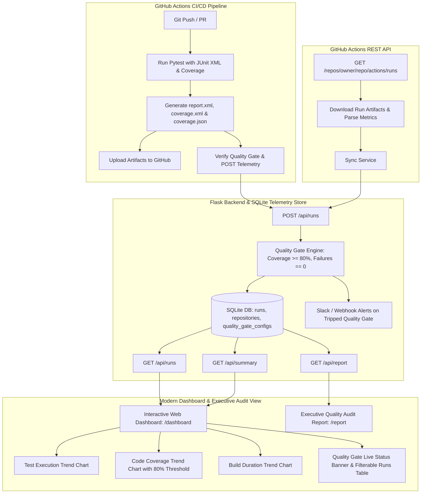

# GatePulse — Universal CI/CD Quality Gate & Metrics Platform

[](https://github.com/varaprasad7477/task-api-devops-project)
[](https://python.org)
[](https://pytest.org)
[](https://docker.com)

> **Project Name**: **GatePulse** *(formerly Task API & DevOps Project)*  
> **Tagline**: Universal CI/CD Quality Gate, Real-time GitHub Telemetry & Observability Engine.

GatePulse is an enterprise-grade CI/CD Quality Gate telemetry platform and Python REST API. It combines automated test suite execution with continuous quality gating, historical trend visualization (pass/fail ratios, coverage %, pipeline execution time), and universal GitHub Actions REST API telemetry ingestion for **any public repository**.

---

## 🌟 Architecture & Data Flow



---

## 📋 System Requirements & Prerequisites

Before running or testing the project, ensure your environment meets the following requirements:

| Requirement | Minimum Version | Notes |
| :--- | :--- | :--- |
| **Python** | `3.10+` (tested on `3.12` and `3.13`) | Core runtime |
| **pip** | `22.0+` | Package manager |
| **Git** | `2.x+` | Version control |
| **Docker & Compose** *(Optional)* | `24.0+` | For containerized execution (`docker compose up`) |

---

## 🚀 Quickstart & Local Setup

### 1. Clone & Set Up Virtual Environment

```bash
# Clone the repository
git clone https://github.com/varaprasad7477/task-api-devops-project.git
cd task-api-devops-project

# Create and activate virtual environment
python -m venv .venv
.venv\Scripts\activate       # On Linux/macOS: source .venv/bin/activate

# Install all dependencies
pip install -r requirements.txt
```

### 2. Seed Sample Telemetry (Optional)

Populate the local SQLite database with 12 sample historical runs over the last 30 days:

```bash
python scripts/seed_metrics.py --force
```

### 3. Run the Application

```bash
python app/main.py
```

- **Interactive Telemetry Dashboard**: Open **[http://localhost:5000/dashboard](http://localhost:5000/dashboard)**
- **Executive Quality Audit Report**: Open **[http://localhost:5000/report](http://localhost:5000/report)**
- **Service Health Check**: `curl http://localhost:5000/health`
- **Tasks REST Endpoint**: `curl http://localhost:5000/tasks`

---

## 🌐 How to Use GatePulse

### 1. Ingest & Analyze Any Public GitHub Repository
1. Open the dashboard at `http://localhost:5000/dashboard`.
2. In the **"Analyze Any Public GitHub Repository"** search bar, paste any public repository link or click a preset:
   - `https://github.com/tiangolo/fastapi`
   - `https://github.com/pallets/flask`
   - `https://github.com/psf/requests`
   - `https://github.com/django/django`
   - `https://github.com/varaprasad7477/task-api-devops-project`
3. Click **"Analyze Repository"**.
4. The system connects to the GitHub Actions REST API, fetches recent workflow runs, queries jobs/steps, evaluates quality standards, updates the SQLite database, and redraws the trend charts and compliance banners.

### 2. View & Export Executive Quality Reports
- **In-Browser UI**: Navigate to `http://localhost:5000/report` (or click **"Full Audit View"** / **"View Quality Report"** on the dashboard).
- **Composite Health Score**: Visual gauge displaying a `0-100` score and letter grade (`A+` to `F`).
- **Rule Compliance Matrix**: Evaluates Code Coverage ($\ge 80\%$), Zero Failures ($0$), Duration ($\le 300\text{s}$), and Status (`success`).
- **Risk Assessment & DevOps Recommendations**: Automated diagnostic insights for engineering teams.
- **Export Options**:
  - **Copy Markdown Summary**: 1-click copy formatted GitHub markdown for pull requests or Slack.
  - **Download JSON**: Full structured data dump for programmatic ingestion.
  - **Print / Save as PDF**: Clean, print-styled executive report.

---

## 🧪 Running Tests & Quality Gate Enforcement

### 1. Run Pytest with JUnit XML & Code Coverage

```bash
pytest -v --junitxml=report.xml --cov=app --cov-report=xml:coverage.xml --cov-report=json:coverage.json --cov-report=term
```

- **46 Unit & Integration Tests**: 100% pass rate.
- **Code Coverage**: ~89.3% across all application modules.

### 2. Enforce Quality Gate Locally via CLI

```bash
python scripts/ci_quality_gate.py --min-coverage 80.0 --max-failures 0 --enforce
```

Generates `$GITHUB_STEP_SUMMARY` markdown reports and verifies:
- `Status`: `✅ PASSED` or `❌ TRIPPED`
- `Code Coverage`: Evaluated against $\ge 80.0\%$ target
- `Test Failures`: $0$ allowed

---

## 🐳 Docker & Container Orchestration

### Run via Docker Compose

```bash
# Build and start the containerized service
docker compose up -d

# Check running health status
curl http://localhost:5000/health

# Run test suite inside container
docker compose --profile test run task-api-tests
```

### Build & Run Docker Image Directly

```bash
docker build -t gatepulse:latest .
docker run -p 5000:5000 gatepulse:latest
```

---

## 📡 API Reference

### Core Task Endpoints

| Method | Endpoint | Description |
| :--- | :--- | :--- |
| `GET` | `/health` | Service health status check |
| `GET` | `/tasks` | List all tasks |
| `POST` | `/tasks` | Create a new task (`{"title": "..."}`) |
| `PUT` | `/tasks/<id>` | Update title, description, or done status |

### Metrics, Telemetry & Report Endpoints

| Method | Endpoint | Description |
| :--- | :--- | :--- |
| `GET` | `/` or `/dashboard` | Interactive Web Dashboard UI |
| `GET` | `/report` or `/audit` | Executive Quality Gate Audit Report UI |
| `GET` | `/api/report` | Comprehensive Quality Gate Audit Report (`?format=json` or `?format=markdown`) |
| `GET` | `/api/runs` | Returns paginated list of runs (`?limit=30&branch=main&quality_gate_passed=true`) |
| `GET` | `/api/runs/<id>` | Returns details and diagnostics of a single run |
| `POST` | `/api/runs` | Ingests a new run result and evaluates Quality Gate |
| `GET` | `/api/summary` | Aggregate statistics (30-day failure rate, avg coverage %, compliance %) |
| `POST` | `/api/sync` or `/api/analyze` | Ingests telemetry for any repository (`{"url": "https://github.com/..."}`) |
| `GET` | `/api/repositories` | List all analyzed & tracked repositories |
| `GET` | `/api/quality-gate/config` | Fetches active quality gate threshold settings |
| `PUT` | `/api/quality-gate/config` | Updates thresholds (min coverage %, max failures, Slack webhook) |
| `POST` | `/api/quality-gate/test-webhook` | Sends a sample alert payload to test webhook delivery |

---

## 📂 Project Structure

```text
task-api-devops-project/
├── app/
│   ├── __init__.py
│   ├── database.py            # SQLite schema, queries, 30-day rolling statistics
│   ├── main.py                # Flask application, REST API & Web UI routes
│   ├── notifications.py       # Slack & Webhook alert notification dispatcher
│   ├── quality_gate.py        # Quality gate policy engine
│   ├── report_generator.py    # Composite Health score & executive report generator
│   ├── report_parser.py       # JUnit XML & Cobertura/JSON coverage parsers
│   ├── sync_service.py        # GitHub Actions REST API sync service & universal URL parser
│   └── templates/
│       ├── dashboard.html     # Tailwind CSS + Chart.js interactive dashboard UI
│       └── report.html        # Executive Quality Gate Audit Report view
├── scripts/
│   ├── ci_quality_gate.py     # CLI tool executed in CI to evaluate gates & post metrics
│   └── seed_metrics.py        # Database seeder with realistic historical runs
├── tests/
│   ├── conftest.py
│   ├── test_ci_script.py      # Unit tests for CI quality gate CLI
│   ├── test_database.py       # SQLite CRUD & statistical aggregation tests
│   ├── test_main.py           # Core Task API endpoint tests
│   ├── test_metrics_api.py    # Metrics & Dashboard API endpoint tests
│   ├── test_notifications.py  # Slack alert tests with mocks
│   ├── test_quality_gate.py   # Quality gate threshold tests
│   ├── test_report_generator.py # Audit report & health score calculation tests
│   ├── test_report_parser.py  # JUnit XML and coverage report parser tests
│   └── test_sync.py           # GitHub REST API sync service & universal URL parser tests
├── .github/workflows/
│   └── ci.yml                 # Automated CI/CD, artifact uploads, quality gating, GHCR push
├── Dockerfile                 # Non-root container image with health check
├── docker-compose.yml         # Container orchestration configuration
├── requirements.txt           # Python dependencies
└── README.md                  # Documentation & user guide
```

---

## 💼 Resume Bullets & Interview Framing

**GatePulse (Task API & DevOps Quality Gate Platform)** | *Python, Flask, SQLite, GitHub Actions, Pytest, Docker, Chart.js*

- **CI/CD Quality Governance**: Architected an automated Quality Gate system integrated into GitHub Actions, enforcing strict test coverage ($\ge 80\%$) and zero-failure policies by parsing JUnit XML and Cobertura reports.
- **Universal Repository Telemetry**: Engineered a telemetry ingestion engine pulling live workflow runs, job step metrics, and commit logs across public GitHub repositories via GitHub Actions REST API (`/actions/runs`).
- **Observability Dashboard & Reporting**: Built an interactive single-page monitoring dashboard with Chart.js trendlines, 30-day rolling failure rate calculations, and an executive Quality Audit Report with Markdown/JSON export capabilities.
- **Enterprise Alerting & Automation**: Implemented Slack webhook notifications triggered on tripped quality gates, generating automated GitHub Actions step summaries and publishing container images to GHCR.
